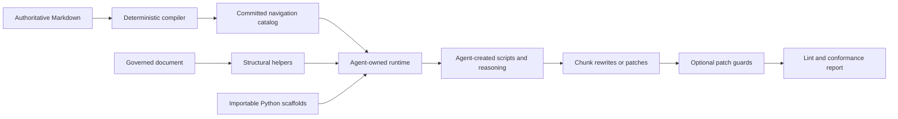

# Plan for agent-navigable ITWS application

## Outcome and fixed decisions

The implementation will keep the current Markdown files as the authoritative specification. Every JSON artifact, rule graph, profile bundle, linter data file, and scaffold record will derive from that source.

The implementation will cover the complete application path through composable scaffolds. It will compile the specification, expose navigation operations, preserve document source boundaries, help agents describe work slices, guard patches, and validate a resulting document.

The repository will not call an agent runtime. An agent will clone or open the repository, read its Markdown, run the supplied Python scripts, import their helper functions, and create additional scripts when the task needs them.

The navigation tools will work from the repository checkout. Their core path will use only the Python standard library. Committed JSON artifacts will let an agent inspect the current version without running a build first.

The reference consumption environment is a default Claude Cowork sandbox that receives only this repository's URL. That sandbox can clone the repository and run Python, but it cannot reliably install external binaries or reach arbitrary network hosts. Every tool an end agent needs at rewrite time must therefore run from the checkout with the Python standard library alone. This constraint removes Vale from the toolchain.

Deterministic code will not decide a passage's §4.1 chunk type, exact or plain layer, materiality, evidence role, caveat relationship, rewrite intent, or dependency meaning. An AI agent will make those judgments by reading the specification and traversing its indexes.

The tools will preserve uncertainty instead of guessing. An agent may record a proposed classification, cite the rules that support it, revise it after further search, or leave it unresolved.

The specification version will advance from `0.5.1-draft` to `0.6.0-draft`. The new machine contract and metadata model are a pre-1.0 architecture change. Historical version records will remain unchanged.

The implementation will use these terms:

- A rule atom is one generated record that contains one rule's identity, normative statement, applicability, navigation metadata, relations, examples, and source location.
- A profile envelope is the complete set of active rules available for a declared version and profile. A tool may narrow this set only from explicit metadata or an agent-supplied applicability decision.
- A navigation beam is the bounded set of rule, example, glossary, skeleton, and relation paths that an agent keeps active while reasoning about one passage.
- A structural manifest is the generated description of a document's declarations, headings, paragraphs, lists, blocks, links, and source spans. It contains no tool-assigned semantic classification.
- A rule trail is an agent-authored record of the rules, sections, examples, and glossary entries that informed one decision.
- A work slice is an agent-chosen set of source spans for one rewrite task. It may include read-only context and declared preservation notes.
- A patch guard is an optional mechanical check for stale source, edits outside a work slice, and overlapping changes.



## 1. Define the specification contract

Update [spec/00-front-matter.md](/opt/forge/writing_spec/spec/00-front-matter.md) with the new version and the agent-operation terms that the normative text needs. Keep operational implementation terms outside the general glossary when governed documents do not need them.

Extend the rule template in [spec/01-foundations.md](/opt/forge/writing_spec/spec/01-foundations.md). Preserve the current rule header, class, machine-checkability, source, profile scope, status, statement, rationale, example pair, and cross-references.

Add controlled metadata that describes each rule and exposes navigation facets. The metadata will not classify document passages. Define closed values for these fields:

- Target granularity, such as document, section, heading, chunk, sentence, term, symbol, equation, citation, figure, table, list, bounded block, or procedure step.
- Construct conditions stated by the rule.
- Applicable chunk types from §4.1.
- Applicable skeleton slots when a rule targets named profile jobs.
- Layer scope: exact, plain, or both.
- Context scope: local passage, neighboring passage, section, document, or document collection.
- Rewrite guidance: mechanical fix available, candidate rewrite possible, review required, or mutation prohibited.
- Typed relations: requires, constrains, overrides, pairs with, validates, and supplies an example for.
- Read and write resources, such as chunk text, heading, term ledger, exact-item ledger, claim ledger, cross-reference ledger, or skeleton order.

State which fields affect normative applicability. State which fields are navigation aids only. A navigation field must never narrow the profile envelope unless an agent selects and justifies an applicability condition from normative text.

State that an agent, not the tool, identifies the constructs, chunk types, layers, and relationships present in a governed document. The tool will validate that an agent uses known identifiers and cites available rules. The tool will not confirm that the semantic judgment is correct.

Encode the current §1.4 precedence order as a generated machine relation. Exactness and safety will remain the first gate. Profile exceptions and structure will remain ahead of sentence style.

Add an agent-artifact section to [spec/08-review-compliance-tooling.md](/opt/forge/writing_spec/spec/08-review-compliance-tooling.md). The section will define generation, version pins, source hashes, stale-result rejection, and the separation between machine findings and human gates.

Reuse the existing rules where they already govern agent behavior. Rule 5.1.1 already prohibits meaning loss. Rule 8.2.4 already prevents a machine run from closing a human gate. Rule 8.4.4 already requires rule-cited findings. Add new permanent rule IDs only for obligations that these rules do not cover.

Update [spec/04-structure.md](/opt/forge/writing_spec/spec/04-structure.md) only where the generated chunk model needs clarification. Generated chunk IDs will remain processing identifiers. Authors will not have to place them in governed documents.

Standardize the optional `Section map` syntax in [spec/annexes/annex-e-document-skeletons.md](/opt/forge/writing_spec/spec/annexes/annex-e-document-skeletons.md). The syntax will map one actual heading to one canonical slot. The parser will reject duplicate, missing, and cross-profile mappings.

Annotate all active rules in the core and overlay rule files. Add parser support before making the new metadata mandatory. After annotation, make the compiler fail when an active rule lacks required metadata or uses an unknown value.

Update these specification records in the same change:

- [spec/README.md](/opt/forge/writing_spec/spec/README.md)
- [README.md](/opt/forge/writing_spec/README.md)
- [spec/annexes/annex-f-traceability.md](/opt/forge/writing_spec/spec/annexes/annex-f-traceability.md)
- [spec/annexes/annex-g-changelog.md](/opt/forge/writing_spec/spec/annexes/annex-g-changelog.md)
- [spec/rule-ids.txt](/opt/forge/writing_spec/spec/rule-ids.txt), if new rules are approved

Regenerate Annex C after the metadata and rule changes. Preserve all historical IDs and changelog entries.

## 2. Create one parser and model for the specification

Add a small Python package under [itws/](/opt/forge/writing_spec/itws). Move shared parsing and validation logic into this package. Keep [tools/itws_index.py](/opt/forge/writing_spec/tools/itws_index.py), [tools/itws_checklist.py](/opt/forge/writing_spec/tools/itws_checklist.py), and [tools/itws_overlays.py](/opt/forge/writing_spec/tools/itws_overlays.py) as compatible command-line entry points.

Keep the runtime package compatible with a repository checkout and the Python standard library. An agent will be able to run `python3 tools/<script>.py` or import `itws` after adding the repository root to `sys.path`. No package installation will be required.

Create typed Python records for rules, profiles, skeletons, slots, glossary entries, examples, relations, phrase lists, and source spans. Do not use untyped dictionaries across module boundaries.

Refactor the current regular-expression parsers into one source parser. Use a conservative line scanner that understands the Markdown forms used by ITWS. The parser will retain exact line ranges for every extracted item. It will expose one normalized model to every generator and checker.

Parse and validate these sources:

- Rule blocks from Parts 2–8 and overlay rule files.
- Profile jobs, minimum tiers, reader outcomes, owner focus, and load sets.
- Skeleton dependency order, required slots, renames, and permitted merges.
- Glossary entries and ladder prerequisites.
- Annex B baseline items and profile reader overlays.
- Annex D example metadata, before text, after text, annotation, and cited rules.
- Phrase lists and mechanical artifact patterns.
- Typed rule relations and section references.

Resolve every rule, section, annex, profile, skeleton, example, and glossary reference. Fail on an unresolved required relation. Permit an informative external reference only when the source marks it as external.

Validate glossary prerequisites as a directed graph. Fail on a cycle, an unknown prerequisite, or a profile value outside the registry.

Keep current command behavior where compatibility matters. Add `--check` modes that compare generated content without writing it.

## 3. Compile versioned agent artifacts

Add [tools/itws_compile.py](/opt/forge/writing_spec/tools/itws_compile.py). The compiler will write committed artifacts under [spec/generated/agent/](/opt/forge/writing_spec/spec/generated/agent).

Generate these files in deterministic order:

- `manifest.json`, containing the ITWS version, schema version, source hashes, artifact hashes, generation command, and artifact inventory.
- `rules.jsonl`, containing one rule atom per active or deprecated rule.
- `rule-graph.json`, containing typed and resolved rule relations.
- `glossary.json`, containing definitions, prerequisites, profiles, statuses, and source spans.
- `reader-baseline.json`, containing shared assumptions, exclusions, notation, and profile conventions.
- `examples.jsonl`, containing rule examples and Annex D rewrite examples.
- `profiles/<profile>.json`, containing the resolved load set, minimum tier, reader overlay, assurance focus, and full profile envelope.
- `skeletons/<profile>.json`, containing ordered slots, required status, renames, merges, and mutation policies.
- `phrase-lists.json`, containing generated linter inputs.

Include the normative statement, rationale, compliant example, non-compliant example, source file, and source lines in each rule atom. Include the checklist pass and precedence layer as derived fields.

Generate a complete profile envelope for every profile. Compare that envelope with the current checklist filtering logic. Fail when the two models disagree.

Make serialization byte deterministic. Sort arrays only when their order has no normative meaning. Preserve canonical order for profiles, skeleton slots, glossary prerequisites, and rule statements.

Update Annex C generation to consume the normalized model. Continue to render Annex C as a human-readable build artifact. Add construct, target, context-scope, and rewrite-guidance columns only when the table remains usable. Keep the full detail in JSON.

Update checklist generation to consume the normalized model or `rules.jsonl`. Stop parsing Annex C's rendered Markdown table as an internal data source.

## 4. Build a structural document index

Add [tools/itws_document.py](/opt/forge/writing_spec/tools/itws_document.py). The tool will parse a governed Markdown document without changing it.

Keep the current three declaration lines as the required declaration format. Parse the ITWS version, canonical profile ID, and conformance tier from the document's front-matter region. Reject conflicting or repeated declarations.

Parse the document into a conservative structural tree. Preserve source offsets and line ranges for headings, paragraphs, lists, tables, code fences, block quotations, links, figures, and captions.

Record syntax, not meaning. The parser may state that a span is a heading, paragraph, list, quotation, code fence, table, or link. It will not state that the span is a claim, requirement, caveat, exact item, plain rendering, definition, observation, or interpretation.

Resolve only explicit skeleton information. Exact canonical headings, permitted renames, and an authored section map may produce confirmed slot links. Any other heading-to-slot relationship will remain an agent decision.

Create run-stable span IDs from the document identity, source range, heading path, and original content hash. These IDs will identify source units during one rewrite run. They will not claim that one source unit equals one semantic §4.1 chunk.

Write `document.structure.json` only when the caller supplies `--out`. Otherwise, write JSON to standard output so an agent can pipe the data into its own script.

Record only these mechanically recoverable fields for each source unit:

- Span ID, source range, source hash, and original text.
- Markdown node type and structural parent.
- Heading path and explicit canonical slot link, when available.
- Previous and next source units.
- Literal links, labels, and identifiers present in the source.
- Applicable profile envelope and generated artifact manifest hash.

Provide an optional `AgentAnalysis` record type. An AI agent may use it to declare §4.1 chunk boundaries, chunk types, exact and plain layers, terms, symbols, names, exact items, claims, evidence, caveats, cross-references, dependencies, mutation policies, and unresolved questions.

Require every semantic annotation to name its source spans and cite the rule or specification section that supports the judgment. Permit an agent to mark a judgment as proposed, accepted for this run, disputed, or unresolved.

Offer a helper that validates the record's identifiers, spans, hashes, and citations. Do not require the record as part of a fixed workflow. Do not validate its semantic truth with deterministic code.

Represent missing information explicitly. Use `unknown`, `not_applicable`, or `blocked` states. Do not turn an absent threshold, fact, source, or acceptance condition into generated prose.

## 5. Build agent-controlled specification navigation

Add [tools/itws_retrieve.py](/opt/forge/writing_spec/tools/itws_retrieve.py).

Expose the same navigation operations as importable Python functions and JSON-producing command-line actions:

- `get_profile` returns the profile job, reader overlay, skeleton, minimum tier, load set, and full profile envelope.
- `get_rule` returns one rule atom by permanent ID.
- `search_rules` performs literal, lexical, and metadata search over the profile envelope.
- `filter_rules` applies facets that the requesting agent supplies.
- `expand_relations` traverses typed rule edges from agent-selected seeds.
- `get_section` returns one numbered specification section with source context.
- `get_examples` returns rule examples and Annex D examples by rule, profile, or agent-supplied tags.
- `get_glossary_entry` returns one term and its prerequisite chain.
- `get_skeleton` returns one profile's ordered slots, renames, merges, and source text.
- `get_reader_baseline` returns the shared baseline and selected profile overlay.
- `assemble_context` returns the exact records that an agent selected for one reasoning step.

Return the full profile envelope before any narrower search result. The default safe view will include all universal rules and all rules that list the declared profile.

Do not infer construct presence, chunk type, layer, skeleton job, materiality, or violation type from document prose. Accept these values only as agent-supplied search facets.

Permit lexical ranking to order matches for convenience. Return match reasons and raw scores. Do not describe rank as applicability, correctness, or repair priority.

Let the agent maintain the navigation beam. The agent will choose seed rules, retain several interpretations, expand relations, inspect examples, and stop when it has enough evidence for its task.

Offer an optional `RuleTrail` helper that records navigation requests, selected records, and agent notes as JSON Lines. Do not require logging for ordinary lookup.

Provide a `Catalog` class that loads committed artifacts from a repository path. Keep each operation small enough for an agent to combine in a short script.

Document direct use:

```python
from pathlib import Path

from itws.catalog import Catalog

catalog = Catalog.from_repo(Path.cwd())
profile = catalog.get_profile("design-rfc")
matches = catalog.search_rules("caveat claim boundary", profile="design-rfc")
neighbors = catalog.expand_relations(["7.2.1"], depth=2)
```

## 6. Provide optional planning scaffolds

Add [tools/itws_work.py](/opt/forge/writing_spec/tools/itws_work.py).

Provide importable record types for a source span, rule trail, work slice, dependency note, preservation note, resource claim, and execution wave. An agent may use all, some, or none of these records.

Show how a coordinator agent can combine structural spans and catalog lookups. The example may declare dependencies for relationships such as:

- Definition before first use.
- Prior before dependent detail.
- Exact statement before or with its plain rendering.
- Evidence before interpretation.
- Claim with its local caveat.
- Heading with its section opening.
- Skeleton slot order.
- Parent condition before subtask verification.
- Procedure prerequisite before the dependent step.

Encourage the agent to cite the rules that justify each dependency, lock, group, and mutation policy. Permit competing dependency hypotheses until the coordinator resolves them.

Offer validation functions for declared spans, source hashes, rule IDs, section citations, dependency endpoints, read resources, write resources, locks, and execution waves.

When an agent uses the execution-wave scaffold, reject a cycle and return its edges. Do not remove an edge or choose a dependency interpretation.

When an agent uses resource claims, flag overlapping writes unless one declared serial dependency orders them. Flag a parallel wave when two work slices declare the same write resource or a write-to-read conflict.

Expose explicit profile mutation policies from the compiled skeleton. Provide a check for policies such as the append-only `investigation-log` rule. Do not infer additional semantic locks.

Provide a helper that can render an agent-authored work slice as a compact context packet. The packet may contain:

- Document declarations and artifact manifest hash.
- Writable source spans and original hashes.
- Read-only neighboring context.
- Agent-declared skeleton slot, chunk boundaries, chunk types, layers, and dependencies.
- Agent-declared term, symbol, name, exact-item, claim, evidence, and caveat records.
- The full profile envelope by reference.
- The agent-selected navigation beam with rule text, specification sections, glossary entries, and examples.
- Agent-declared rewrite operations, locks, and prohibited mutations.
- Agent-authored output instructions and blocker policy.

Do not require a repository-wide job format. An agent may create its own dictionaries, files, or prompts when the supplied records do not fit the task.

## 7. Supply local Python examples

Document the local helper library in [spec/agent/README.md](/opt/forge/writing_spec/spec/agent/README.md). Describe it as a scaffold, not a required execution protocol.

Add copyable scripts under [examples/agent-scripts/](/opt/forge/writing_spec/examples/agent-scripts):

- `inspect_profile.py` prints one profile's load set, reader overlay, skeleton, and rule IDs.
- `search_rule_graph.py` searches rules and expands relations from agent-selected seeds.
- `inspect_term_chain.py` prints a glossary entry and its prerequisites.
- `outline_document.py` prints headings and source spans without semantic labels.
- `make_work_slice.py` shows how an agent can combine spans, rule records, context, and preservation notes.
- `check_chunk_patch.py` checks a proposed edit against source hashes and allowed spans.

Keep each example short. State which parts an agent is expected to replace with its own reasoning.

Make every CLI useful through standard output. Support `--json` for machine use and a compact text form for direct reading.

Give each public helper a short docstring, stable argument names, and typed return values. Give each script complete `--help` output and meaningful exit codes.

Accept `--repo` or `--spec-dir` where path discovery could be ambiguous. Default to the current repository checkout.

Do not add a server, provider adapter, prompt runner, agent loop, or required result-import protocol.

## 8. Guard chunk rewrites without choosing them

Add [tools/itws_patch.py](/opt/forge/writing_spec/tools/itws_patch.py).

Provide helpers that compare an original document with a proposed document or unified diff. Report changed source ranges, original hashes, and affected structural spans.

Allow an agent to supply an optional work slice. Check whether the patch changes text outside its declared writable spans.

Check stale source hashes before applying a patch. Check overlapping patches before an agent combines parallel work.

Run machine-checkable lint against a proposed patch or document. Reject only failures that deterministic code can establish.

Do not decide whether a patch preserves exact meaning, uses the correct chunk type, keeps the right evidence relationship, or represents the best rewrite. Return the original text, changed text, rule findings, and nearby context so the agent can decide.

Provide pure functions for patch inspection and conflict detection. Keep patch application as an explicit caller action.

Support an optional audit record with source hashes, changed spans, rule trails, agent notes, and validation output. Do not require a selection schema or integration report.

## 9. Implement lint and conformance validation

Implement the `itws-lint` behavior specified in [spec/08-review-compliance-tooling.md](/opt/forge/writing_spec/spec/08-review-compliance-tooling.md).

Revise §8.2 in the same specification change. Remove the Vale dependency and the packaged Google and Microsoft rule sets. Define the linter as a repository-local engine that uses only the Python standard library. A default Claude Cowork sandbox cannot install the Vale binary or fetch Vale style packages, and the consumption environment sets the tooling floor. Update rule 8.2.1's source note, Annex C, and Annex F in the same change.

Add [tools/itws_lint.py](/opt/forge/writing_spec/tools/itws_lint.py). The linter will resolve the exact version and profile, run phrase-list and pattern checks compiled from the authoritative Markdown into `phrase-lists.json`, run custom structural checks, and combine findings under one schema. Generate every check input from the specification source. Do not maintain the same living list by hand in two places.

Port the word-list, punctuation, and usage adjudications that Parts 2–3 adapted from the Google and Microsoft style guides into the generated phrase lists wherever the underlying rule is machine-checkable. Compute readability metrics with a standard-library implementation. Readability metrics will not gate conformance.

Implement every rule marked `Machine-checkable: yes`, or change its metadata with a justified specification revision. Make the compiler fail when a `yes` rule has no registered checker.

Implement only the mechanical candidate signals described by `partial` rules. Treat each signal as a navigation lead. Do not convert a signal into a semantic classification or confirmed violation.

Generate agent-review packages for `partial` and `no` rules. Let the reviewing agent navigate the cited rule, its relations, examples, reader baseline, and relevant document spans before it records a finding.

Give every finding a rule ID, class-derived severity, source span, message, checker identity, and optional repair operator. Preserve the mandatory error, recommended warning, and permitted suggestion map.

Separate offline and network checks. DOI, URL, and archive checks will run only when network validation is enabled. A skipped required network check will leave validation incomplete.

Add [tools/itws_validate.py](/opt/forge/writing_spec/tools/itws_validate.py). The command will run version checks, explicit profile checks, mechanically decidable skeleton checks, lint, generated checklist checks, and agent-review record checks.

Return separate states for `pass`, `fail`, `needs_review`, and `blocked`. A clean machine run will not complete author, owner, proxy, reader-test, or release gates.

## 10. Expand examples and create evaluation fixtures

Normalize every Annex D `Rules applied` field to permanent rule IDs. Keep section citations only as additional context.

Add stable example IDs and authored navigation annotations to [spec/annexes/annex-d-examples-corpus.md](/opt/forge/writing_spec/spec/annexes/annex-d-examples-corpus.md). The annotations may name chunk types, constructs, preservation notes, and repair operators. The compiler will extract these labels. It will not derive them from the prose.

Complete the stated 22-example milestone. Add a second example for each profile that currently has one. Keep the balance policy and source-diversity policy.

Create end-to-end fixture documents for all eleven profile skeletons under [tests/fixtures/documents/](/opt/forge/writing_spec/tests/fixtures/documents). Include conforming documents, locally repairable violations, blocked missing-information cases, and overlapping patch cases.

Add focused fixtures for these risks:

- A term is used before its definition.
- Two workers propose different names for one artifact.
- A plain rewrite widens an exact claim.
- A caveat is moved away from its claim.
- A procedure worker reorders a safety dependency.
- A worker edits an earlier investigation-log entry.
- Two jobs write the same span.
- A patch targets a stale source hash.
- An agent revises its passage classification after traversing a related rule.
- A navigation beam omits a relevant style rule while the full profile envelope remains available.
- A machine-clean result still needs a human exactness review.

## 11. Add tests and one repeatable check command

Use the standard-library `unittest` package. Add tests for parsing, metadata validation, line ranges, relation resolution, glossary cycles, profile load sets, explicit skeleton mapping, artifact generation, structural indexing, navigation operations, optional analysis records, optional work-slice checks, patch guards, and lint severity.

Add golden tests for Annex C, generated JSON, checklists, profile manifests, navigation results, structural outlines, patch reports, and validation reports.

Test deterministic generation by compiling twice and comparing bytes. Test patch conflict detection with the same patches in different input orders.

Add negative tests that prove the deterministic tools do not emit semantic chunk types, prose layers, exact-item links, evidence relationships, or rewrite selections without an agent-authored record.

Test backward compatibility for the three existing tool commands. Preserve their current arguments unless the new model requires an additive option.

Add [tools/itws_check_all.py](/opt/forge/writing_spec/tools/itws_check_all.py). The command will run specification validation, generated-artifact checks, unit tests, lint, and the eleven-profile fixture suite.

Document the equivalent individual commands so a failure can be isolated.

## 12. Document the author and tool workflows

Update [spec/README.md](/opt/forge/writing_spec/spec/README.md) with the generated artifact contract and commands.

Update [README.md](/opt/forge/writing_spec/README.md) with one short application path for writers and one for tool authors.

Open the root README with an agent-facing entry point. An AI agent that receives only this repository and a rewrite request must find one instruction at the top: read [spec/agent/README.md](/opt/forge/writing_spec/spec/agent/README.md) and follow the documented sequence. The human collaborator supplies only the repository URL, the target document, and the intended audience or profile when they know it. The agent performs the clone, the profile selection or clarifying question, the navigation, and the rewrite.

Split [AGENTS.md](/opt/forge/writing_spec/AGENTS.md) by session purpose. A maintainer session edits the specification and owes changelog entries and version increments. A consumer session rewrites an external document against the specification, never modifies the specification, and owes no changelog. State the distinction first, because agent harnesses load this file before any other documentation.

Add one copyable kickoff prompt to the root README, and a matching skill file that a team can install in their agent environment. Both say the same thing: clone or open this repository, read the agent entry point, and rewrite the named document to conform. Keep both optional; the entry-point README alone must be sufficient.

Document this repository-local sequence:

```text
python3 tools/itws_compile.py --check
python3 tools/itws_retrieve.py get-profile design-rfc --json
python3 tools/itws_retrieve.py search-rules "interface invariant" --profile design-rfc --json
python3 tools/itws_retrieve.py expand-relations 5.1.1 --depth 2 --json
python3 tools/itws_document.py outline --input <document> --json
# The agent may now create and run its own Python script with imports from itws.
python3 <agent-created-script>.py
python3 tools/itws_patch.py check --base <document> --proposed <rewritten-document>
python3 tools/itws_validate.py --input <proposed-document>
```

Document how an agent can inspect unresolved terms, revisit a rule trail, detect stale patches, compare overlapping edits, and rerun validation.

State that the generated artifacts and Python helpers are local scaffolds. State that agents may read the files directly or write new scripts around the importable library. State that the Markdown specification remains authoritative. State that deterministic tools preserve structure and check mechanical conditions, while AI agents make semantic judgments.

## 13. Pilot and completion conditions

Run the first compact pilot with `decision-record` as a cold start. Give a fresh agent session only the repository URL, a raw document, and a one-sentence rewrite request. Confirm that the agent can clone the repository, find the entry point, run the supplied scripts, create a small Python helper, classify passages, and produce a guarded rewrite without further human instruction.

Run the structural stress pilot with `design-rfc`. Confirm that the coordinator agent can identify requirements, exact/plain links, alternatives, risks, and rollout dependencies through specification navigation.

Run the mutation-policy pilot with `investigation-log`. Confirm that prior entries cannot be rewritten.

Run the vocabulary and evidence stress pilot with `research-paper`. Confirm the term ladder, symbols, equations, evidence, claim strength, limitations, and human review state.

Run the final fixture suite across all eleven profiles.

The work is complete when all of these conditions hold:

- Every active and deprecated permanent rule appears exactly once in the compiled rule set.
- Every active rule has valid navigation, context-scope, rewrite-guidance, and relation metadata.
- Every profile manifest resolves the same profile envelope as the generated checklist.
- Every required skeleton slot, rename, and merge has a structured representation.
- Every generated artifact is byte deterministic and covered by the manifest hashes.
- The committed navigation catalog works from a clean checkout without package installation.
- A fresh agent session that receives only the repository URL and a rewrite request reaches the documented workflow without human tooling knowledge.
- Every example script runs with the Python standard library.
- Every machine-checkable `yes` rule has a registered checker.
- The structural parser emits no semantic passage classifications.
- Optional agent analysis and work-slice records can cite source spans and specification support.
- Patch guards detect stale source, writes outside declared spans, and overlapping changes.
- No supplied tool requires an agent to adopt one job, prompt, or result format.
- Golden rewrites preserve every exact item and introduce no unsupported fact.
- The validator reports human gates separately and never treats lint as conformance.
- All eleven profile fixtures pass their expected outcomes.
- Annex C, generated artifacts, checklists, traceability, version declarations, rule registry, and changelog are current.

## 14. Main implementation risks

Metadata curation can drift from rule meaning. Compiler coverage checks and typed relation validation will make that drift a build failure.

A local rewrite can damage global vocabulary or evidence state. Rule trails, optional analysis records, patch reports, and whole-document validation will expose that risk.

Source spans can become stale after an edit. Content hashes will reject stale work before merge.

An agent can narrow its search too early. The navigator will keep the full profile envelope available, record each search path, and let the agent return to earlier branches.

An agent can choose the wrong passage classification. The tools will preserve alternative and disputed classifications, require rule citations, and support a separate review agent.

An agent can invent content when evidence is absent. The blocked state and agent-authored exact-item record will require the pipeline to report the gap instead.

Machine checks can imply more assurance than they provide. The four-state validator and existing human-gate rules will preserve the distinction.

Generated output can create noisy diffs. Stable ordering, canonical serialization, and `--check` modes will keep output reproducible.

A dependency can prevent an agent from running the scaffolds in its session. The core navigation and document helpers will therefore use only the Python standard library.
